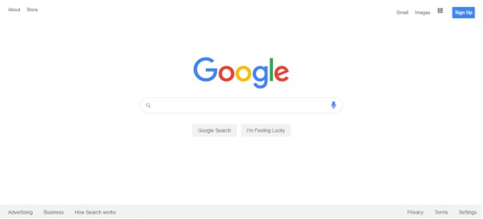

# Google Clone

This project is an experiment where I tried to clone Google using **HTML** and **CSS**.
It was created to learn the basics of HTML and CSS and to practice more with these technologies.

## Screenshots

